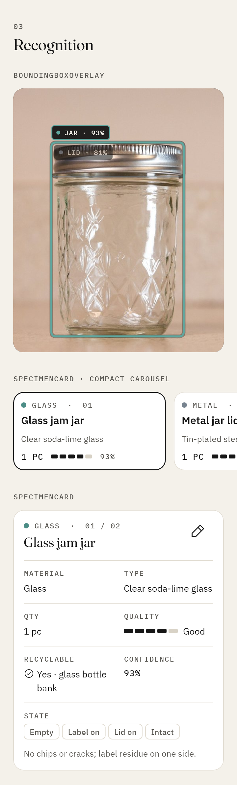
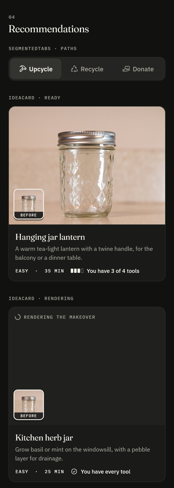

# Kanz design system

Kanz (كنز, "treasure") helps people see what the things they are about to throw away are made of, and what they could become. The interface is a **field guide meets a maker's workshop**: calm, editorial, tactile and precise. The user's own photos and the generated makeovers are the hero visuals; the interface around them stays quiet.

Code: `app/lib/core/design/` (tokens, theme, typography, icons, components), exported from one barrel, `package:kanz/core/design/design.dart`. Every component is in the design gallery (`/gallery`, debug builds) and rendered by the screenshot harness (`app/test/screenshots/`). Curated renders are in [`docs/design/`](docs/design/).

| | |
|---|---|
|  |  |

## 1. Principles

1. **The photo is the hero.** Chrome recedes: paper and ink, hairlines, no decorative fills. Color on screen should mostly come from the user's photo, the generated images and the material data.
2. **One accent, used on purpose.** Clay marks the scan action, active states and the before/after handle. Nothing else is clay. Primary buttons are ink.
3. **Data reads like a specimen label.** Materials, quantities and condition are set in IBM Plex Mono labels over plain values, in hairline grids, like a museum label or a lab spec sheet.
4. **Honest states.** Every AI step has a visible state (pending, active, done, failed, skipped) with a plain label. Skeletons mirror the content they stand in for. Errors say what happened and offer a retry.
5. **Built for both directions.** Arabic is a first-class layout, not a mirror applied at the end: its own type system, directional icons that flip, others that do not.
6. **Restraint over decoration.** Mostly flat, generous whitespace, start-aligned layouts, short motion.

## 2. Color

Tokens live in `KanzColors` (a `ThemeExtension`, `context.kanzColors`). Contrast ratios below are measured with the WCAG 2.x formula (`KanzContrast.ratio`) and enforced by `app/test/design/contrast_test.dart`.

### Light

| Token | Value | Use | Contrast |
|---|---|---|---|
| `background` | `#F4F1EA` | Paper, behind cards and lists | |
| `surface` | `#FFFFFF` | Cards, sheets, dialogs, navigation bar | |
| `surfaceSunken` | `#ECE8DF` | Segmented tracks, callouts, skeletons, source tags | |
| `raised` | `#FFFFFF` | Segmented-tab thumb | |
| `track` | `#D8D2C6` | Empty segments of quality, step and material bars | 1.33 on background (decorative) |
| `ink` | `#161616` | Text, icons, primary button fill | 16.04 bg · 18.10 surface · 14.80 sunken |
| `inkSecondary` | `#5C5A55` | Secondary text, data labels | 6.11 bg · 6.89 surface · 5.63 sunken |
| `inkDisabled` | `#A9A59C` | Disabled text (exempt) | |
| `line` | `#E2DDD3` | Hairline dividers and card borders (decorative) | |
| `lineStrong` | `#8A857B` | Control boundaries: inputs, outlined buttons and icon buttons, unselected chips, checkboxes, the state-block circle | 3.25 bg · 3.67 surface |
| `accent` (clay) | `#C65026` | Scan action, active states, slider handle | 4.07 bg · 4.59 surface |
| `onAccent` | `#FFFFFF` | Text and glyphs on clay | 4.59 |
| `inverse` / `onInverse` | `#161616` / `#F4F1EA` | Selected chips, snackbars | 16.04 |
| `danger` / `onDanger` | `#B3261E` / `#FFFFFF` | Errors, hazards, destructive button | 5.79 bg · 6.54 surface · 6.54 on fill |
| `caution` | `#8A5D00` | Warning callout glyph and title | 5.11 bg · 5.76 surface · 4.71 sunken |
| `positive` | `#2F6B3A` | "Open now" | 5.67 bg · 6.39 surface · 5.23 sunken |

### Dark

| Token | Value | Contrast |
|---|---|---|
| `background` | `#111210` | |
| `surface` | `#1A1B19` | |
| `surfaceSunken` | `#242522` | |
| `raised` | `#33342F` | ink 10.93 · inkSecondary 5.10 |
| `track` | `#3A3B36` | 1.53 on surface (decorative) |
| `ink` | `#F2EFE8` | 16.36 bg · 15.05 surface · 13.42 sunken |
| `inkSecondary` | `#A8A59C` | 7.63 bg · 7.02 surface · 6.26 sunken |
| `inkDisabled` | `#5E5C56` | |
| `line` | `#2C2D29` | |
| `lineStrong` | `#77746C` | 4.02 bg · 3.70 surface |
| `accent` (clay) | `#F07A4F` | 6.80 bg · 6.26 surface |
| `onAccent` | `#161616` | 6.55 |
| `inverse` / `onInverse` | `#F2EFE8` / `#161616` | 15.76 |
| `danger` / `onDanger` | `#F28B82` / `#161616` | 7.86 bg · 7.58 on fill |
| `caution` | `#E3B341` | 9.65 bg |
| `positive` | `#8FC79A` | 9.67 bg |

**Accent tuning.** The starting clay `#D9582B` gave white text only 3.9:1, so light clay is deepened to `#C65026` (4.59:1 with white, still terracotta). In dark mode clay lightens to `#F07A4F` and takes ink glyphs (6.55:1).

**Rules.** Clay appears only on the scan action (nav bar, Home call to action, shutter), active states (selected nav tab bar, active pipeline stage, current tutorial step, toggled icon buttons, framed viewfinder brackets) and the before/after handle. The `ColorScheme` is built slot by slot from these tokens (primary = ink, tertiary = clay, no tonal surface tint); `theme_test.dart` fails if any slot is purple.

### Material colors

Data colors for chips, dots, bounding boxes and map pins only, never large fills (`KanzMaterialColors`). The canonical colors come from `contracts/vocab.json`; where a color falls under 3:1 against a theme's background or surface, a lightness-shifted variant with the same hue is used for that theme. Bounding boxes on photos use the canonical color with a dark halo, since photos have no theme.

| Category | Canonical | Light variant | Light min ratio | Dark variant | Dark min ratio |
|---|---|---|---|---|---|
| glass | `#5FA8A0` | `#4C8D86` | 3.41 | `#5FA8A0` | 6.25 |
| plastic | `#3D6FD9` | `#3D6FD9` | 4.16 | `#3D6FD9` | 3.68 |
| paper | `#B8895A` | `#A87848` | 3.42 | `#B8895A` | 5.57 |
| metal | `#7D8894` | `#77838F` | 3.43 | `#7D8894` | 4.79 |
| textile | `#4B5A9C` | `#4B5A9C` | 5.74 | `#5B6AB0` | 3.40 |
| wood | `#8A5A3B` | `#8A5A3B` | 5.16 | `#976240` | 3.41 |
| electronics | `#D4A017` | `#A47C12` | 3.40 | `#D4A017` | 7.28 |
| hazardous | `#B3261E` | `#B3261E` | 5.79 | `#D42D23` | 3.46 |
| organic | `#6B7F3A` | `#6B7F3A` | 3.94 | `#6B7F3A` | 3.89 |
| other | `#9A968C` | `#858175` | 3.45 | `#9A968C` | 5.86 |

### On photos

Chrome laid over photos and the camera preview (box tags, before/after labels, the shutter ring, viewfinder controls) uses `KanzPhotoColors`, the same in both themes because photos have no theme. Ratios are measured over the worst case, a white photo, and enforced by `contrast_test.dart`.

| Token | Value | Use | Contrast over a white photo |
|---|---|---|---|
| `KanzPhotoColors.ink` | `#F2EFE8` | Text, hairlines, rings, the slider divider | 13.52 on `tag` · 8.35 on `control` |
| `KanzPhotoColors.tag` | `#161616` at 94 % | Solid label chips | |
| `KanzPhotoColors.control` | `#161616` at 80 % | Discs behind icon buttons (a tint, never blur) | |
| `KanzPhotoColors.accent` | dark clay `#F07A4F` | A toggled control on a photo (flash on) | 3.47 on `control` |

A dot is never the only carrier of meaning: the category name is always next to it, or in the semantics label (`PlaceRow.materialsLabel`). Avoid text on material fills; if needed, `MaterialSwatch.onColor` picks ink or white by contrast.

## 3. Typography

Fraunces for large headings, step numbers and big numerals, sparingly. IBM Plex Sans for interface text. IBM Plex Mono, uppercase and tracked, for data labels (`PET · #1 · 3 PCS`). For Arabic every role switches to IBM Plex Sans Arabic with taller line heights and zero tracking (tracking breaks Arabic joins; Fraunces has no Arabic glyphs). Every style carries the other script's family as a fallback so mixed strings render. Pass the locale to the theme: `KanzTheme.light(locale: locale)`. Each theme is built once per brightness and script and then reused, so rebuilding the app root never starts a theme animation.

| Role | Latin | Arabic | Use |
|---|---|---|---|
| displayLarge | Fraunces 300, 48/52, −0.8 | Plex Arabic 500, 40/56 | Rare hero moments |
| displayMedium | Fraunces 300, 40/44, −0.6 | Plex Arabic 500, 34/48 | Completion screen |
| displaySmall | Fraunces 400, 32/38, −0.4 | Plex Arabic 600, 28/40 | Home headline |
| headlineLarge | Fraunces 400, 28/34 | Plex Arabic 600, 25/38 | Screen titles |
| headlineMedium | Fraunces 400, 24/30 | Plex Arabic 600, 22/33 | Section titles, step titles, rationale titles |
| headlineSmall | Fraunces 400, 20/26 | Plex Arabic 600, 19/29 | Card titles (ideas, specimens, swaps), sheet titles |
| titleLarge | Plex Sans 600, 18/24 | Plex Arabic 600, 18/28 | App bar, sub-sections inside a detail page |
| titleMedium | Plex Sans 600, 16/22 | Plex Arabic 600, 16/25 | Place names, compact cards |
| titleSmall | Plex Sans 600, 14/20 | Plex Arabic 600, 14/22 | Tabs |
| bodyLarge | Plex Sans 400, 16/24 | Plex Arabic 400, 16/27 | Instructions, reasons |
| bodyMedium | Plex Sans 400, 14/21 | Plex Arabic 400, 14/23 | Default body |
| bodySmall | Plex Sans 400, 13/19, secondary | Plex Arabic 400, 13/21 | Captions, addresses |
| labelLarge | Plex Sans 500, 15/20 | Plex Arabic 500, 15/22 | Buttons |
| labelMedium | Plex Sans 500, 13/18 | Plex Arabic 500, 13/20 | Chips, badges |
| labelSmall | Plex Sans 500, 12/16, secondary | Plex Arabic 500, 12/18 | Nav labels, tags |
| `KanzType.data` | Plex Mono 500, 11/16, +1.1, uppercase | Plex Arabic 500, 12/18 | Data labels |
| `KanzType.dataStrong` | Plex Mono 500, 13/18, +0.6 | Plex Arabic 500, 14/22 | Counts, codes, confidence |
| `KanzType.numeralLarge` | Fraunces 300, 56/60, lining tabular | same | Impact numbers |
| `KanzType.numeral` | Fraunces 300, 40/44, lining tabular | same | Step numbers ("03 / 07") |

## 4. Space, shape and depth

- **Grid:** 8 pt with 4 pt half steps (`KanzSpace.s4 … s64`). Screen gutter 20 (`KanzSpace.page`, direction-aware). Touch targets 48 dp minimum.
- **Radii** (`KanzRadii`): sheets 20, cards 16, buttons 14, inputs 12, chips 10, tags 6. Larger containers get larger radii.
- **Depth:** mostly flat. Cards are white on paper with a 1 px `line` border and no shadow. Soft two-layer shadows (`KanzElevation.floating`) only on floating elements: the before/after handle, the photo inset on idea cards, an elevated scan action over content. Cards are never nested in cards.

## 5. Motion

| Token | Value | Use |
|---|---|---|
| `KanzMotion.fast` | 150 ms | Press states, color changes, chip selection |
| `KanzMotion.medium` | 250 ms | Tab thumb, timeline collapse, step segments |
| `KanzMotion.slow` | 350 ms | Page transitions, image fade-in, fade-up entrances |
| `KanzMotion.enter` | M3 emphasized decelerate | Things arriving |
| `KanzMotion.exit` | M3 emphasized accelerate | Things leaving |
| `KanzMotion.emphasized` | M3 emphasized | Things moving on screen |
| `KanzMotion.stagger` | 40 ms, max 6 items | Card lists (`FadeUp.staggered`, `StaggeredColumn`) |

Page transition (`KanzPageTransitionsBuilder`): fade in while rising 3 %, 350 ms; iOS keeps the native swipe-back transition. Nothing bounces, nothing loops except progress (spinners, the slow skeleton pulse). The one longer sequence is the recognition reveal (below), about 1.4 s.

**Reduced motion:** when `MediaQuery.disableAnimations` is set, `KanzMotion.of` returns zero durations, skeletons stop pulsing, the scan line and draw-in are skipped, the active pipeline stage becomes a static clay dot, and page transitions become a plain cross-fade.

**Haptics** (`KanzHaptics`): medium impact on capture, light impact on step completion, a selection tick when the before/after handle reaches an end. Nowhere else.

## 6. Icons

Phosphor, regular weight, everywhere (`KanzIcons`). The package marks every glyph as mirroring, which would flip a camera or a leaf in Arabic, so Kanz declares its own `const` glyphs: only directional ones (arrows, carets, lists, undo, send, external link) mirror. No sparkle "AI" icons, no robots.

## 7. Components

All components are pure widgets: no Riverpod, no localization lookups (every string, including semantics labels, is passed in), direction-aware padding and alignment.

| Component | Use it for | Rules |
|---|---|---|
| `KanzButton` (primary, `.secondary`, `.tertiary`, `.destructive`) | Actions | One primary per screen. Primary is ink. `icon` leads the label; `trailingIcon` follows it for forward actions ("See the tutorial" with `KanzIcons.forward`). `loading` keeps size and color, shows a spinner, ignores taps and is announced by its `loadingLabel`. |
| `KanzIconButton` (plain, outlined, onPhoto) | Toolbar and photo controls | Always 48 dp with a semantics label, which also shows as a visual tooltip. The outlined circle is `lineStrong` (3:1). `selected` (clay) makes it a toggle; leave it null for plain actions so they are not announced as toggles. |
| `ScanActionButton` | The scan action | Round in the nav bar, wide with a label on Home. The only clay button. Flat in the bar, `elevated` over content. |
| `ShutterButton` | Camera capture | Clay disc in a thin ring; sinks on press, fires the capture haptic; `busy` turns the ring into a spinner. |
| `CornerBrackets` | Viewfinder frame | Warm white; clay when an item is framed. |
| `KanzChip` | Filters and choices | Outlined in `lineStrong` (3:1 against paper and cards); selected is ink. Optional `MaterialDot` or glyph, optional count. 48 dp target. |
| `MaterialDot`, `MonoLabel`, `DataGrid`, `QualityBar`, `StateTags` | Recognition data | Mono label above plain value; quality always as five segments with a word, which wraps under the bar rather than being cut. `MonoLabel` shows uppercase but reads the original text to screen readers ("950 m", not "950 M"); pass `textDirection: TextDirection.ltr` for numeric sequences. |
| `SpecimenCard` (+ `compact`, `SpecimenCarousel`) | A recognized item | Dot + name, then MATERIAL, TYPE, QTY, QUALITY, RECYCLABLE, CONFIDENCE, STATE. `hazardLabel` adds a danger row for disposal-only items. Edit affordance on the full card. Selected = 1.5 px ink border. Carousel cards share the tallest height; `initialIndex` opens the row on a given card and `controller` scrolls it (`SpecimenCarousel.offsetFor(i, itemWidth)`). Choose `itemWidth` so the next card peeks by no more than its inner padding (or by a whole word). The index ("01 / 02") always reads left to right. |
| `BoundingBoxOverlay` | Photo with detections | Boxes in 0..1 image space mapped with the image's `BoxFit` (onto the whole photo when the size is unknown); tags placed so they never overlap; selected box heavier, others recede. Show the photo before the analysis returns with no boxes: the reveal waits for the first detections and replays for a new set of items. |
| `PipelineTimeline` | The live analysis | One row per real backend stage with honest labels; failed stages explain and offer retry unless the stage says `retryable: false` (a used-up image quota); collapses to one summary line when done. |
| `SegmentedTabs` | Upcycle / Recycle / Donate | Equal segments, sliding raised thumb, optional glyph and count. |
| `IdeaCard` + `ToolMatchBadge` | Upcycling ideas | 4:3 after image with the original photo inset; skeleton while rendering (`after: null`), desaturated original with `errorLabel` when the image fails to load or `failed: true` says it could not be generated (no `after` needed). `original` is nullable: a text scan has no photo, so the card shows no inset and a quiet sunken panel in place of the failure photo. Fraunces title; mono meta joined with " · ". |
| `BeforeAfterSlider` | Comparing photo and makeover | Clay handle; semantic slider with 10 % steps; arrow keys; before sits on the reading-start side. |
| `SourceChips` | RAG grounding | Quiet tags naming the knowledge documents an answer used. |
| `StepNumeral`, `StepProgressBar` | Tutorial | "02 / 05" in Fraunces (always left to right); done ink, current clay, upcoming track. |
| `Callout` (tip, warning, safety) | Notes in tutorials and results | Sunken fill, glyph, mono title. Never a colored slab. |
| `SectionHeader`, `KanzSheet`, `KanzListTile` | Structure | Start-aligned headers: `large: true` (Fraunces `headlineMedium`) for a page's top-level sections, the sans default for sub-sections inside a detail page. Sheets radius 20 with a handle and pinned actions. List-tile and switch-tile hairlines sit inside both gutters; only `PlaceRow` lists run full bleed. |
| `PlaceRow` | Drop-off points | Name and mono distance, then type and address with the accepted-material dots at the end of that line, the open state, a directions button. `hideUnknownHours` leaves the hours line out for places that list none (most OpenStreetMap places), so "Hours not listed" does not repeat on every row. |
| `SwapCard` | Eco swaps | One quiet line "Instead of single-use plastic bags", then → "Try" (the only mono cue, with a mirrored arrow) over the Fraunces swap, why, one tip, and under a hairline the meta ("Low effort · Low cost", no colons) and an optional `footer` (impact note, `SourceChips`) inside the card. |
| `StatNumeral`, `MaterialBars` | Impact | Big Fraunces numbers; bars in material colors, longest first. |
| `Skeleton`, `FadeUp`, `StaggeredColumn` | Loading and entrances | Low contrast, slow pulse, static with reduced motion. |
| `EmptyState`, `ErrorState`, `OfflineBanner` | States | One anatomy for both, always full width and on the start gutter: 56 dp circle (`lineStrong`; `danger` stroke and glyph for errors), Fraunces `headlineSmall` title, `bodyMedium` message in `inkSecondary` that gives the cause and what still works, then a full-width action (secondary; `primaryAction: true` when it is the only way forward). Errors end with the support code: mono `codeLabel` ("Support code") over the id (`errorSupportCode(error)`: the request id, with the wire code in debug builds). A null `onRetry` hides the retry. `OfflineBanner` is a quiet sunken strip with a hairline under it and a caution glyph (a 14 dp spinner while `checking`), never an inverse slab. |
| `PermissionRationale` | Camera and location asks | Drawn geometric art, concrete reasons, primary + an alternative that still works (gallery, city picker). After a refusal, `notice` (a warning `Callout`) says what happened right under the title; with no `reasons` (restricted by policy) the alternative becomes the primary action. |
| `KanzTextField`, `KanzSwitchTile` | Forms and settings | Label above the field; the helper or error and the character count sit under it on the same gutter as the label. URLs, numbers and codes pass `textDirection: TextDirection.ltr` (and `textAlign` if needed) so they read left to right in Arabic. Whole switch row toggles. |
| `KanzNavBar` | Shell navigation | Home, Drop-off, [scan], Swaps, Impact. Selected tab is ink with a short clay bar. |
| `BrandMark`, `BrandLockup` | Identity | The faceted gem; lockup pairs "Kanz" (Fraunces) with "كنز". |

Maps use `KanzMapStyles.assetFor(brightness)`: muted paper (or warm near-black) land, quiet roads, desaturated water, no points of interest, so material-colored pins lead.

## 8. Signature moments

1. **Capture to recognition.** Clay shutter with a haptic; the captured photo flies (Hero) into the results screen and waits there while the analysis runs; when the detections arrive one thin scan line passes over the photo once, then material-colored outlines draw in item by item and their mono tags fade in; the specimen carousel fades up below.
2. **The pipeline, told honestly.** Stages tick from pending to done with real durations, then fold into one line ("Done in 12.2 s · 3 ideas · 3 places").
3. **Makeovers arriving.** Idea cards appear with skeletons that name what is happening; each after image fades in as it lands, the user's photo inset in the corner for comparison.
4. **Before and after.** A full-width slider with a clay handle turns the idea into a visible transformation.
5. **The tutorial.** Big Fraunces step numerals, a segmented progress bar with the current step in clay, a light haptic on each completed step.

## 9. Copy voice

Short, specific and human. Say what is happening and what to do next. Name the actual thing ("Glass jam jar", "Rendering the makeover", "Image generation is paused on this server"). No hype ("unlock", "revolutionize", "supercharge", "magic"), no exclamation marks, no emojis. Sentence case everywhere; uppercase only through `MonoLabel`. Errors never blame the user and always offer the next step.

## 10. Accessibility and RTL

- Contrast: AA for all text (4.5:1) and 3:1 for control boundaries, the accent and data dots, tested in both themes.
- Targets: 48 dp minimum for every interactive element (chips, tabs, icon buttons, nav items, slider).
- Text scale: every component lays out at 130 % without overflow in both directions (`components_test.dart`); nav labels scale to 130 % and then shrink to fit rather than wrap. Photo tags stay fixed (they are anchored to the image) and each box carries a full semantics label.
- Semantics: icon buttons have labels; quality bars, step bars and tool matches announce a sentence; the before/after slider is a real slider with increase and decrease; tabs report selection; live regions for pipeline progress, errors and offline state. Controls that replace their children's semantics with one clean label (scan action, shutter, chips, segments, nav items, the pipeline summary) declare the tap action themselves, and `semantics_test.dart` activates each one through the semantics tree the way TalkBack does.
- Nothing is cut: at 130 % text in both languages no text in the component catalog is ellipsized or clipped (`components_test.dart` fails on any `didExceedMaxLines`). Long values wrap; only the compact carousel card limits the material line (to two lines).
- RTL: `EdgeInsetsDirectional` and `AlignmentDirectional` everywhere; directional icons mirror, others do not; numeric sequences ("02 / 05", "01 / 02") are laid out left to right, since the bidi algorithm would otherwise show "05 / 02"; the before image sits on the right in Arabic; bounding boxes never mirror (they are image space).

## 11. Bans

Purple, blue or neon gradients; gradient text; glassmorphism and blur; glow; emojis in the UI; sparkle "AI" icons or robots; stock or 3D illustrations and blobs; default Material purple; Roboto or Inter; shadows on every card; cards nested in cards; bouncy or long animations; confetti; lorem ipsum; fake stats or testimonials; hype copy; centered-everything layouts; more than one accent color.

## 12. Tooling

| What | Where |
|---|---|
| Design gallery (every component, theme / Arabic / 130 % toggles) | `app/lib/features/gallery/`, route `/gallery` |
| Screenshot harness (real fonts, 360 and 412 dp, light/dark, EN/AR, text scale) | `app/test/screenshots/harness.dart`; run `flutter test test/screenshots`, PNGs in `test/screenshots/_out/` |
| Design tests (contrast, theme hues and caching, material colors, 130 % layout with no cut text, behavior, screen-reader actions, reduced motion) | `app/test/design/` |
| Brand PNGs from the mark geometry | `app/tool/brand/make_brand.py`, then `dart run flutter_launcher_icons` and `dart run flutter_native_splash:create` |
| Map styles | `app/assets/map_styles/light.json`, `dark.json` |

The after image in the curated renders is the input photo standing in for a generated makeover: image generation needs a billed Gemini key, and the component renders any image the same way.
